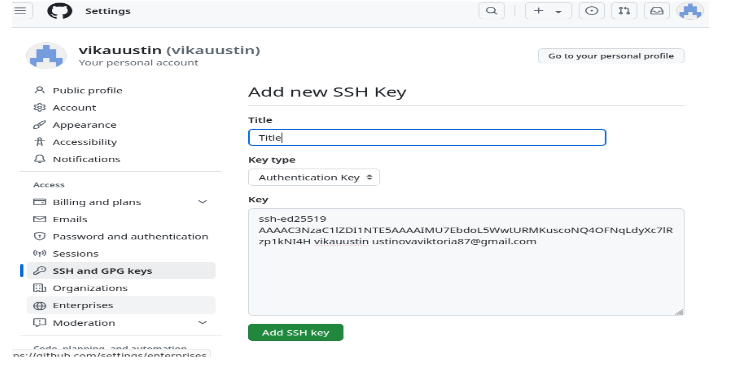

---
## Front matter
title: "лабораторная работа №2"
subtitle: "Отчет"
author: "Устинова Виктория Вадимовна"

## Generic otions
lang: ru-RU
toc-title: "Содержание"

## Bibliography
bibliography: bib/cite.bib
csl: pandoc/csl/gost-r-7-0-5-2008-numeric.csl

## Pdf output format
toc: true # Table of contents
toc-depth: 2
lof: true # List of figures
lot: true # List of tables
fontsize: 12pt
linestretch: 1.5
papersize: a4
documentclass: scrreprt
## I18n polyglossia
polyglossia-lang:
  name: russian
  options:
	- spelling=modern
	- babelshorthands=true
polyglossia-otherlangs:
  name: english
## I18n babel
babel-lang: russian
babel-otherlangs: english
## Fonts
mainfont: IBM Plex Serif
romanfont: IBM Plex Serif
sansfont: IBM Plex Sans
monofont: IBM Plex Mono
mathfont: STIX Two Math
mainfontoptions: Ligatures=Common,Ligatures=TeX,Scale=0.94
romanfontoptions: Ligatures=Common,Ligatures=TeX,Scale=0.94
sansfontoptions: Ligatures=Common,Ligatures=TeX,Scale=MatchLowercase,Scale=0.94
monofontoptions: Scale=MatchLowercase,Scale=0.94,FakeStretch=0.9
mathfontoptions:
## Biblatex
biblatex: true
biblio-style: "gost-numeric"
biblatexoptions:
  - parentracker=true
  - backend=biber
  - hyperref=auto
  - language=auto
  - autolang=other*
  - citestyle=gost-numeric
## Pandoc-crossref LaTeX customization
figureTitle: "Рис."
tableTitle: "Таблица"
listingTitle: "Листинг"
lofTitle: "Список иллюстраций"
lotTitle: "Список таблиц"
lolTitle: "Листинги"
## Misc options
indent: true
header-includes:
  - \usepackage{indentfirst}
  - \usepackage{float} # keep figures where there are in the text
  - \floatplacement{figure}{H} # keep figures where there are in the text
---

# Цель работы

Изучить идеологию и применение средств контроля версий. Приобрести
практические навыки по работе с системой git, а конкретней настроить его, создать
собственный репозиторий, добавить туда отчет по лабораторной работе.

# Задание

Создать базовую конфигурацию для работы с git.
Создать SSH ключ.
Настроить подписи git.
Зарегистрироваться на Guthub.
Создать локальный каталог для выполнений заданий по предмету.

# Выполнение лабораторной работы

*1. Базовая настройка Git.*

Сначала сделаем предварительную конфигурацию git.

{#fig:001 width=70%}

Настроим utf-8 в выводе сообщений git.

{#fig:002 width=70%}

Зададим имя начальной ветки (будем называть её master).

{#fig:003 width=70%}

Задаем параметр autocrlf.

{#fig:004 width=70%}

Задаем параметр safecrlf.

{#fig:005 width=70%}

*2. Создание SSh ключа*

Для последующей идентификации пользователя на сервере репозиториев
необходимо сгенерировать пару ключей (приватный и открытый):

{#fig:006 width=70%}

Далее необходимо загрузить сгенерированный открытый ключ. Для этого
зайти на сайт http: //github.org/ под своей учётной записью и перейти в меню
Setting . После этого выбрать в боковом меню SSH and GPG keys и нажать
кнопку New SSH key . Скопировав из локальной консоли ключ в буфер
обмена.

{#fig:007 width=70%}

Вставляем ключ в появившееся на сайте поле и указываем для ключа имя
(Title).

{#fig:008 width=70%}

{#fig:009 width=70%}

*3. Сознание рабочего пространства и репозитория курса на основе шаблона*

{#fig:010 width=70%}

*4. Сознание репозитория курса на основе шаблона*

Требуется перейти на станицу репозитория с шаблоном курса и выбрать Use this template

{#fig:011 width=70%}

Клонируем созданный репозиторий, используя ссылку для клонирования на странице созданного репозитория Code > SSH.

{#fig:012 width=70%}

*5. Настройка каталога курса*

{#fig:013 width=70%}

{#fig:014 width=70%}

{#fig:015 width=70%}

{#fig:016 width=70%}

{#fig:017 width=70%}

{#fig:018 width=70%}

*Задание для самостоятельной работы.*
• Создайте отчет по выполнению лабораторной работы в соответствующем
каталоге рабочего пространства.

• Скопируйте отчеты по выполнению предыдущих лабораторных работ в
соответствующие каталоги созданного рабочего пространства.

• Загрузите файлы на github.

{#fig:019 width=70%}

{#fig:020 width=70%}

# Выводы

Нам удалось успешно ознакомиться с системой контроля git, выучить некоторые
команды для работы с ней, изучить идеологию и применение средств контроля
версий, создать свой репозиторий на платформе github.

